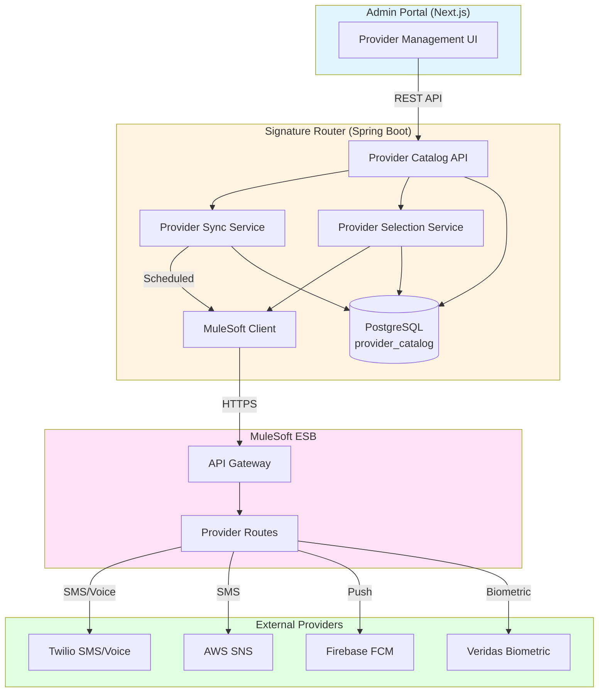
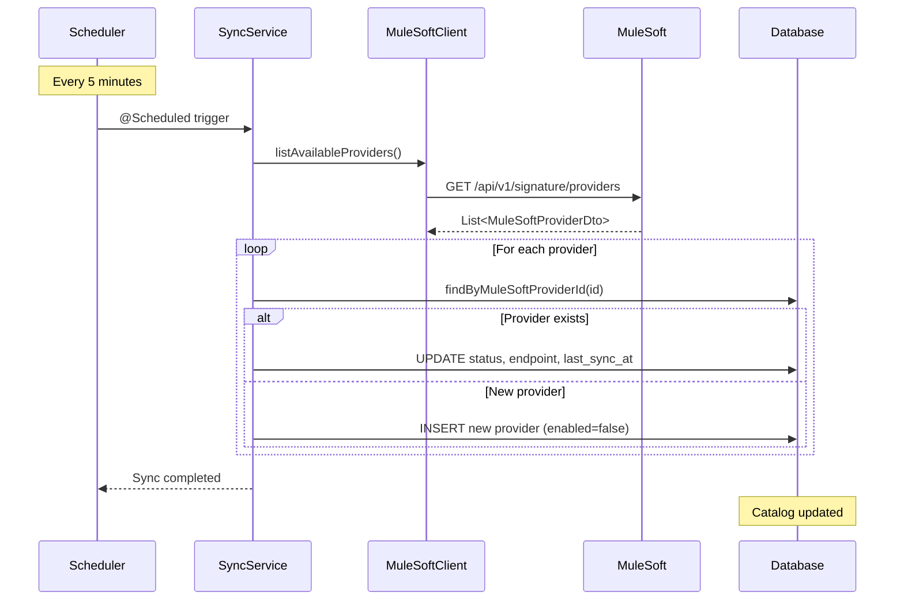
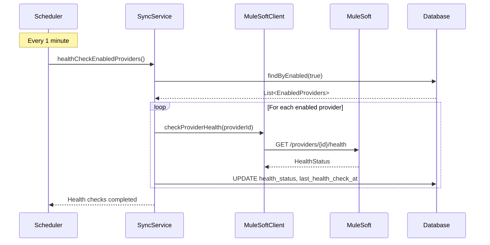
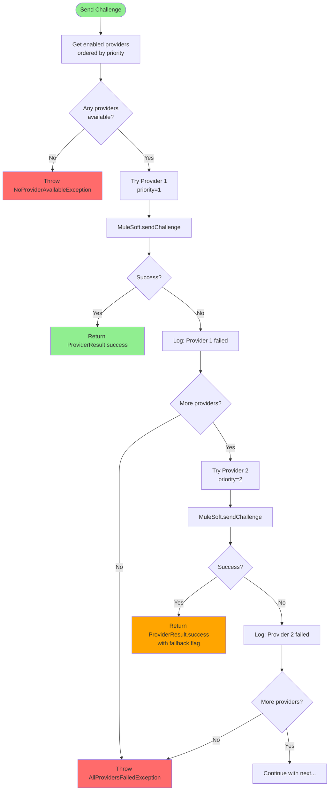
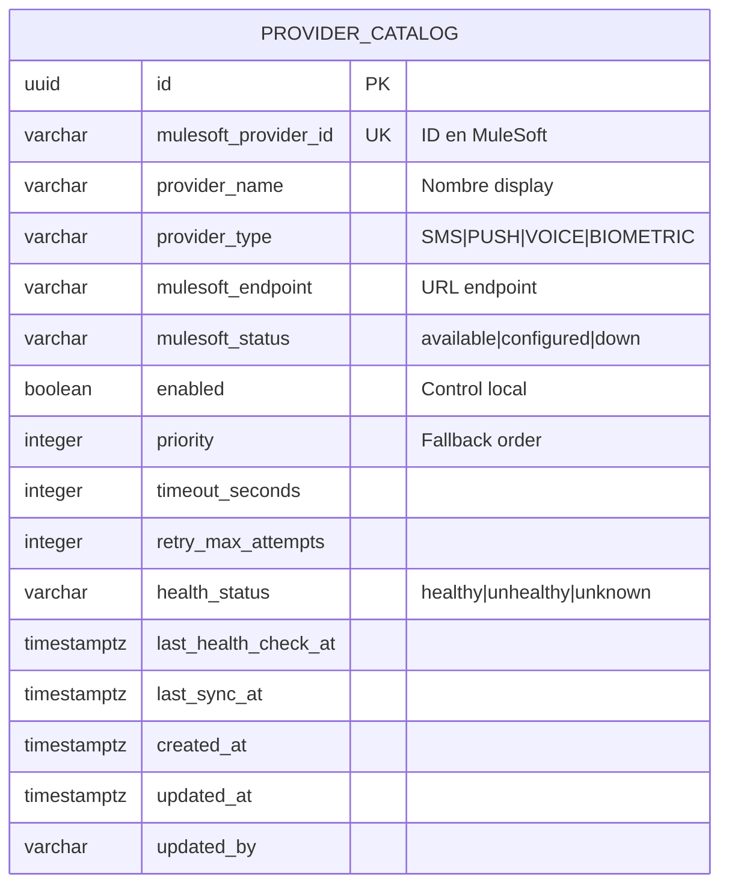
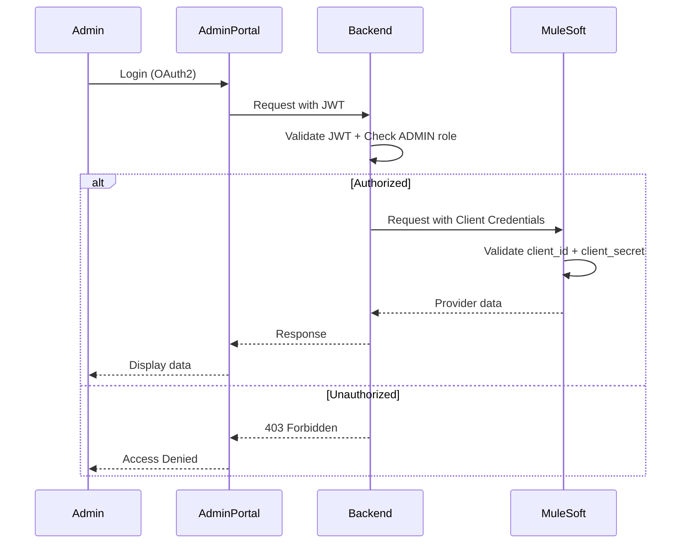
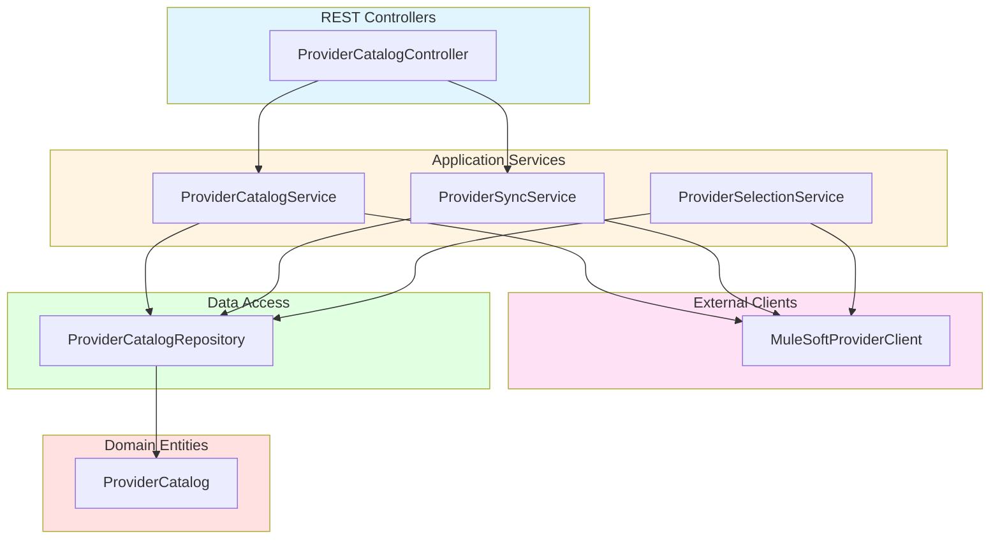
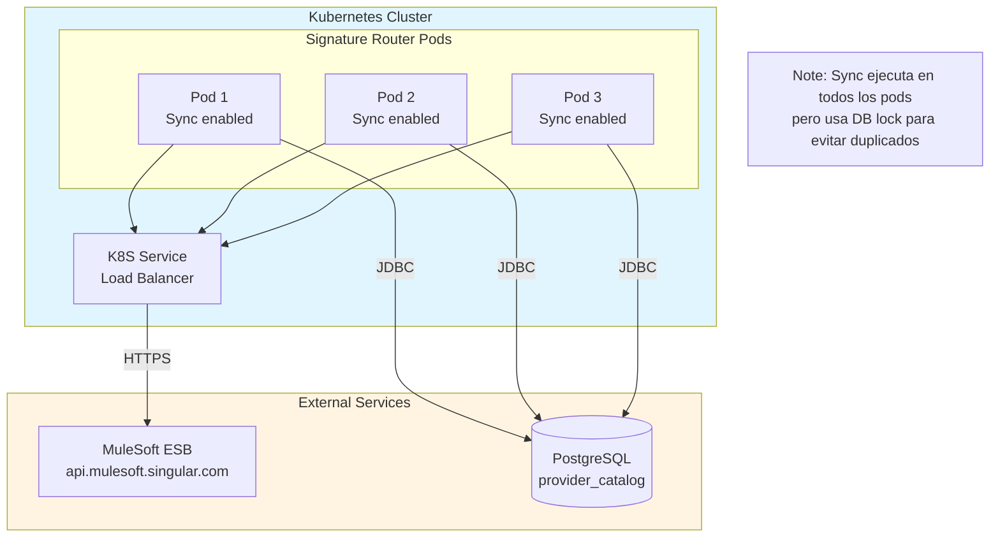
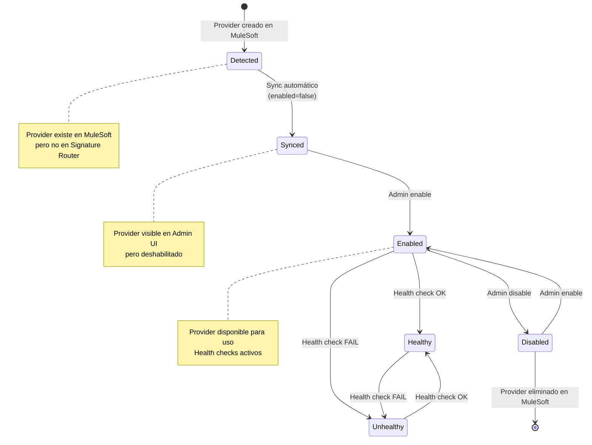
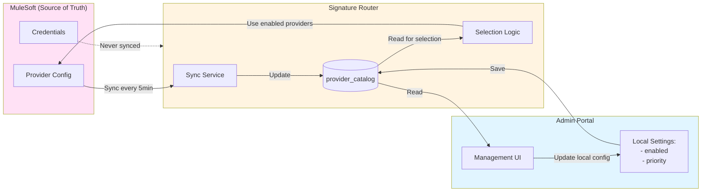

# Epic 13: MuleSoft Integration - Architecture Diagrams

**Fecha:** 5 de diciembre de 2025

---

## 🏗️ Arquitectura General



---

## 🔄 Flujo de Sincronización



---

## 💚 Flujo de Health Check



---

## 📤 Flujo de Envío con Fallback



---

## 🖥️ Admin UI - User Flow

```mermaid
flowchart LR
    Start([Admin accede a<br/>Provider Management]) --> Load[GET /api/v1/admin/providers]
    
    Load --> Display[Mostrar catálogo<br/>agrupado por tipo]
    
    Display --> Actions{Acción del admin}
    
    Actions -->|Sync manual| Sync[POST /providers/sync]
    Actions -->|Enable provider| Enable[PUT /providers/{id}/enable]
    Actions -->|Disable provider| Disable[PUT /providers/{id}/disable]
    Actions -->|Change priority| Priority[PUT /providers/{id}/priority]
    Actions -->|Check health| Health[GET /providers/{id}/health]
    
    Sync --> Reload[Reload UI]
    Enable --> Reload
    Disable --> Reload
    Priority --> Reload
    Health --> ShowHealth[Mostrar estado de salud]
    
    Reload --> Display
    ShowHealth --> Display
    
    style Start fill:#e1f5ff
    style Display fill:#fff4e1
    style Sync fill:#90EE90
    style Enable fill:#90EE90
    style Disable fill:#FF6B6B
    style Priority fill:#FFA500
```

---

## 🗄️ Database Schema



---

## 🔐 Security Flow



---

## 📊 Component Interaction



---

## 🚀 Deployment Architecture



---

## 📈 State Diagram - Provider Lifecycle



---

## 🔄 Data Flow - Provider Configuration



---

**Documento creado:** 5 de diciembre de 2025  
**Última actualización:** 5 de diciembre de 2025  
**Owner:** Architecture Team
